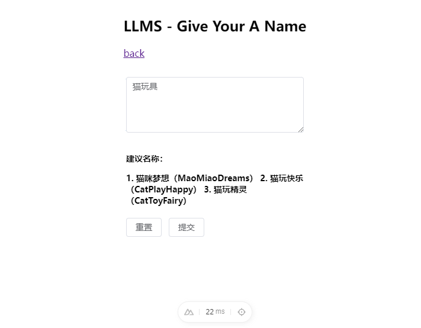
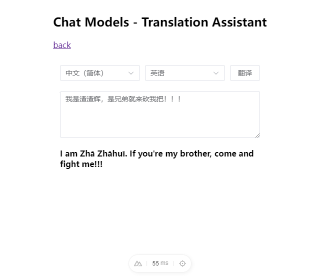
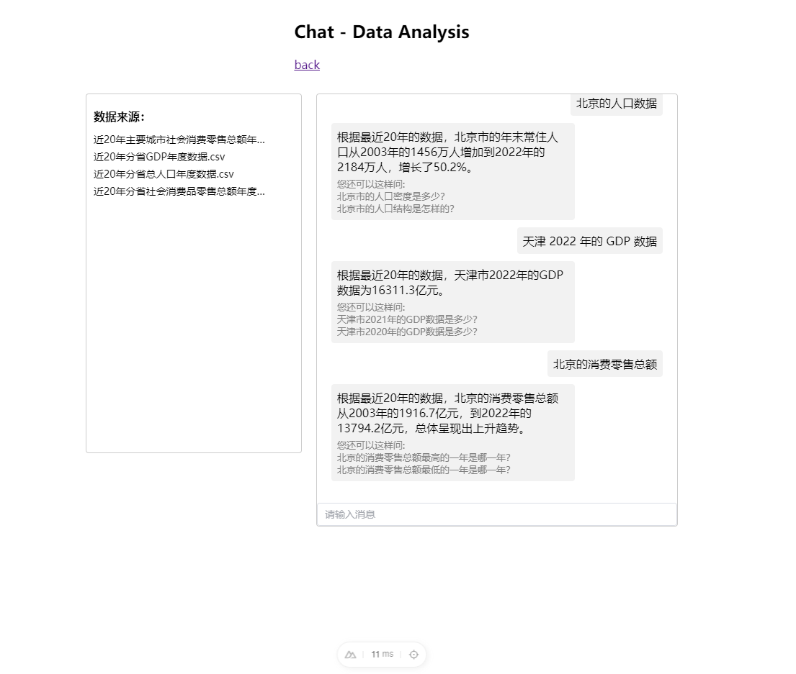

# langchain-examples

langchain.js 案例集

* llms - give your a name
* chat models - translation assistant
* chat - data analysis

## windows proxy

```bash
export http_proxy=http://127.0.0.1:7890
export https_proxy=http://127.0.0.1:7890
```

## Use

### create env file

部分案例使用本地 .env 文件，需要自主创建。

```bash
OPENAI_API_KEY=<your key>
```

### setup

```bash
pnpm install
```

### dev server

```bash
pnpm run dev
```

### production

```bash
pnpm run build
```

### local preview

```bash
pnpm run preview
```

## examples

### 1. give your a name



### 2. translation assistant



### 3. data analysis - chat

