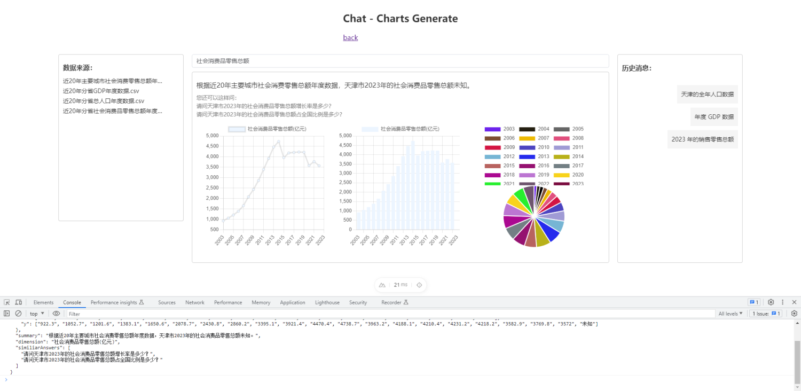
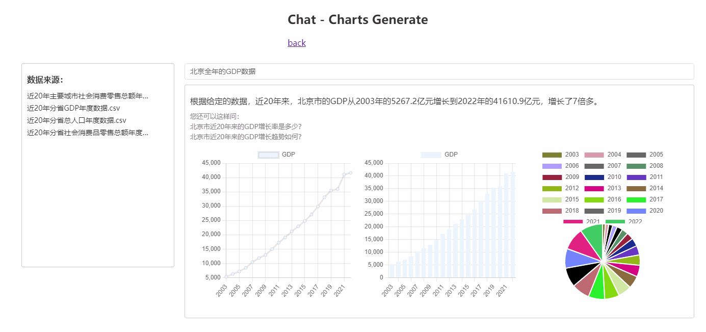

# langchain-examples

langchain.js 案例集

## langchain

LangChain 是一个开源的语言建模和对话生成框架，用于构建自然语言处理（NLP）应用程序。
它提供了一套工具和库，用于处理文本、生成对话、进行问答等任务。

LangChain 的目标是简化开发者构建和训练自然语言处理模型的过程。
它提供了一组易于使用的API和工具，帮助开发者处理和分析文本数据，并生成与用户进行交互的对话。

LangChain 基于机器学习和深度学习技术，使用神经网络模型进行语言建模和对话生成。
它可以用于构建聊天机器人、智能助手、对话系统等应用。

## examples

* llms - give your a name
  * Models + Prompts + Chains
* chat models - translation assistant
  * Models + Prompts + Chains
* chat - data analysis
  * Models + Prompts + Chains + Indexs + Memory
    * 数据向量化、问题向量化、相似性搜索（基于向量）
    * 接入 llm（openai）润色，生成目标结果
* chat - charts generate
  * Models + Prompts + Chains + Indexs + Memory
    * 数据向量化、问题向量化、相似性搜索（基于向量）
    * 接入 llm（openai）润色，生成目标结果
  
  * 支持多轮对话（加入上下文缓存）
    * memory 缓存历史对话记录，结合 openai 实现问题更正
    * 继续处理后续逻辑
    
## windows proxy

```bash
export http_proxy=http://127.0.0.1:7890
export https_proxy=http://127.0.0.1:7890
```

## how to use

### create env file

部分案例使用本地 .env 文件，需要自主创建。

```bash
OPENAI_API_KEY=<your key>
```

### setup

```bash
pnpm install
```

### dev server

```bash
pnpm run dev
```

### production

```bash
pnpm run build
```

### local preview

```bash
pnpm run preview
```

## examples preview

### 1. give your a name


### 2. translation assistant


### 3. data analysis - chat


### 4. charts generate - chat





